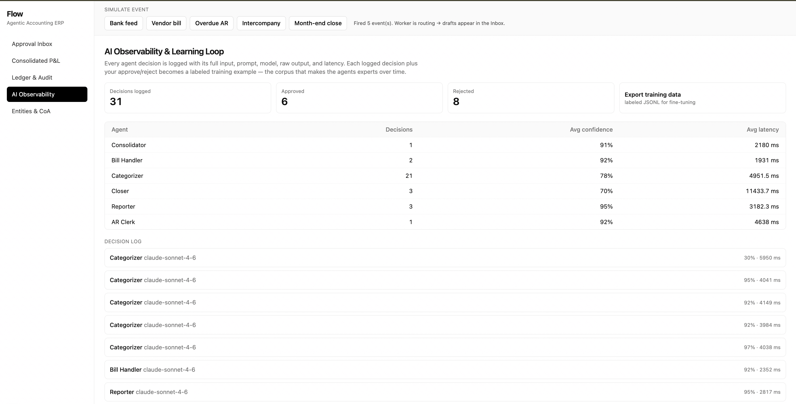

# Observability & the Learning Loop

Everything an agent decides is logged, and every human decision becomes a label. That
combination is the "brain" — the dataset that makes the agents better over time.

The **AI Observability** screen: per-agent metrics, a one-click labeled-data export, and the
full decision log (each row expands to its prompt, raw model output, and parsed result):



## What is captured

Every agent LLM call writes an **`AgentTrace`** row
([`db/models.py`](backend/app/db/models.py)) via
[`llm.client.complete_json`](backend/app/llm/client.py) → recorded in
[`agents/base.propose`](backend/app/agents/base.py):

| Field | Meaning |
|-------|---------|
| `agent`, `role`, `model`, `mock` | who decided, which Claude model, real vs mock |
| `system_prompt`, `user_prompt` | the exact prompt sent (incl. the safety preamble) |
| `raw_response` | the model's raw output |
| `parsed_decision` | the structured JSON the agent acted on |
| `confidence`, `latency_ms` | self-reported confidence and wall-clock latency |
| `proposed_action_id` | links the decision to the draft it produced |

Nothing is hidden: prompts, raw output, and the parsed decision are all retained, so any
proposal can be explained and replayed.

## The supervision signal

Each `ProposedAction` is later **approved or rejected** by a human, written immutably to
`AuditLog`. Joining `AgentTrace → ProposedAction → AuditLog` yields a labeled example:

```json
{
  "agent": "Categorizer",
  "model": "claude-sonnet-4-6",
  "input": "Transaction: 'AWS WEB SERVICES', amount -340.00 ...",
  "output": {"account_code": "5000", "account_name": "Software Subscriptions", "confidence": 0.82},
  "human_label": "approved",
  "reward": 1
}
```

`reward = 1` (approved) / `0` (rejected) is the preference signal.

## Endpoints

| Endpoint | Purpose |
|----------|---------|
| `GET /observability/traces` | recent decisions (live feed, also in the UI) |
| `GET /observability/stats` | per-agent counts, avg confidence, avg latency, approve/reject totals |
| `GET /observability/training-data` | labeled corpus as JSON |
| `GET /observability/training-data.jsonl` | same corpus as downloadable **JSONL** |

The **AI Observability** page in the app shows the live decision log, per-agent metrics,
and a one-click training-data export.

## How the agents actually improve (honestly)

Three mechanisms, strongest first — no magic:

1. **Retrieval memory (active today).** When the Categorizer's proposal is approved, the
   categorization is written back to the pgvector store
   ([`services/vectors.py`](backend/app/services/vectors.py)). Future similar transactions
   retrieve it as an example, so the system demonstrably gets more accurate per vendor
   without any model training. This is the live "learning loop".
2. **Evaluation set.** The labeled JSONL is a regression/eval suite: measure each agent's
   approve-rate and catch prompt regressions before they ship.
3. **Supervised fine-tuning / distillation.** The same JSONL is SFT-ready. Note: Anthropic's
   Claude models are used here via the API and broad customer fine-tuning is not assumed —
   so the corpus is built provider-neutral. Use it to (a) fine-tune an open model for a
   cheaper specialist, or (b) curate few-shot exemplars injected into Claude prompts. Either
   way the human-labeled corpus is the asset.

> Important: improvement never bypasses the human gate. A better model still only proposes
> drafts — approval stays with a person, and every new decision is logged the same way.
