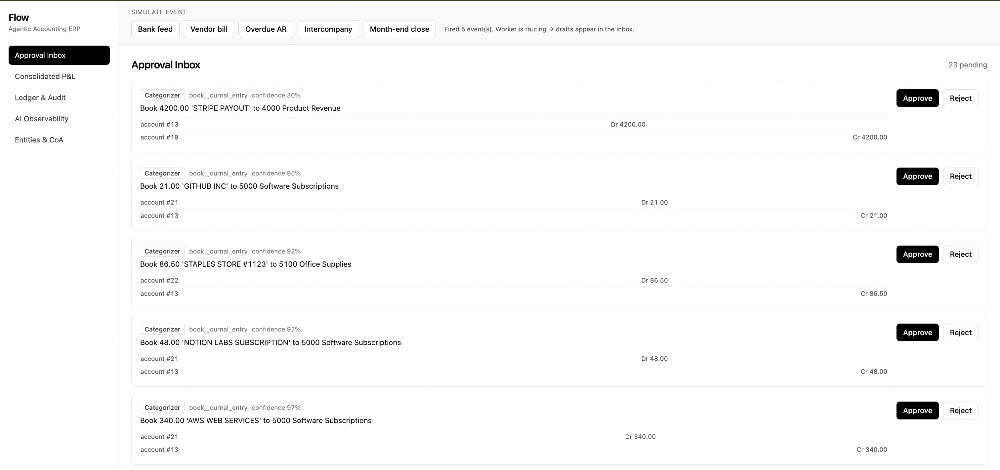
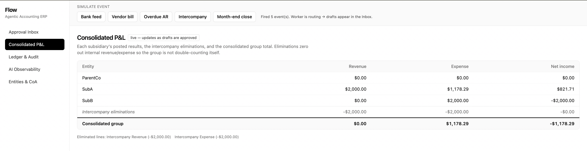
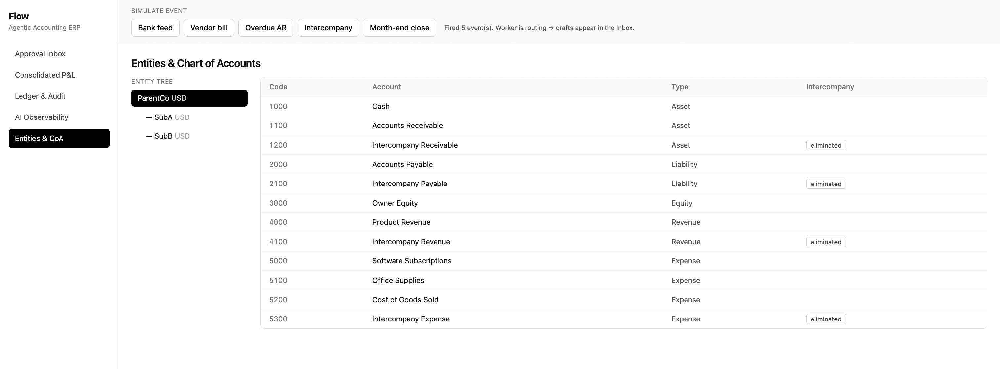

# Agentic Accounting ERP

> An AI-native accounting system where **named AI agents do the bookkeeping** and humans
> simply review and approve.
> Powered by the **Anthropic API** (Claude) with **LangGraph** orchestration.

This README is written so that **anyone** engineer or not can understand what this
project is, how it works, and how to run and extend it. Read it top to bottom for full
context, or jump via the table of contents.

---

## Table of contents

1. [What is this, in plain English?](#1-what-is-this-in-plain-english)
2. [The three big ideas](#2-the-three-big-ideas)
3. [The 8 AI agents](#3-the-8-ai-agents)
4. [How one transaction flows through the system](#4-how-one-transaction-flows-through-the-system)
5. [Architecture at a glance](#5-architecture-at-a-glance)
6. [Tech stack (and why)](#6-tech-stack-and-why)
7. [Quickstart — run it in 2 minutes](#7-quickstart--run-it-in-2-minutes)
8. [Guided demo walkthrough](#8-guided-demo-walkthrough)
9. [Project layout — what every folder does](#9-project-layout--what-every-folder-does)
10. [Data model](#10-data-model)
11. [API reference](#11-api-reference)
12. [Configuration (environment variables)](#12-configuration-environment-variables)
13. [Testing](#13-testing)
14. [Observability, security & the learning loop](#14-observability-security--the-learning-loop)
15. [How to extend it (add your own agent)](#15-how-to-extend-it-add-your-own-agent)
16. [Troubleshooting & FAQ](#16-troubleshooting--faq)
17. [Glossary for non-accountants](#17-glossary-for-non-accountants)

---

## 1. What is this, in plain English?

Traditional accounting software is a tool a *human* uses to record money movements. **Agentic Accounting ERP flips that around**: AI agents read each incoming transaction (a bank charge, an invoice, a bill) and do the accounting work themselves. A human's job becomes **supervising** looking
at what the AI proposes and clicking **Approve** or **Reject**.

Crucially, the AI can **never finalize anything on its own**. Every action it takes is saved
as a **draft**. Nothing hits the official books until a person approves it, and every
approval is recorded forever in an **audit log**. This is what makes it safe to trust AI
with accounting.

### Screenshots

**Approval Inbox** — the AI proposes drafts; a human approves or rejects each one.



**Consolidated P&L** — live multi-entity report with intercompany eliminations.



## 2. The three big ideas

| Idea | What it means | Where it lives in the code |
|------|---------------|----------------------------|
| **Agentic orchestration** | A supervisor ("the Orchestrator") looks at each event and hands it to the right specialist agent. The supervisor never does math itself. | [`agents/graph.py`](backend/app/agents/graph.py) |
| **Human-in-the-loop (HITL)** | Agents only ever write **drafts**. A human must approve before anything posts. Every decision → an immutable audit log. | [`services/approvals.py`](backend/app/services/approvals.py) |
| **Continuous consolidation** | Multi-entity reports and intercompany eliminations recompute on *every* approval — not in a slow month-end batch. | [`services/consolidation.py`](backend/app/services/consolidation.py) |

## 3. The 8 AI agents

A "team" of specialists coordinated by the Orchestrator. Each uses a Claude model chosen for
its job (routing table: [`llm/client.py`](backend/app/llm/client.py)).

| Agent | What it does | Model |
|-------|--------------|-------|
| **Orchestrator** | Classifies each event and routes it to one specialist. Does no accounting. | `claude-opus-4-8` |
| **Categorizer** | Books a bank line to the right GL account, using vector memory of how similar past transactions were categorized. | `claude-sonnet-4-6` |
| **Reconciler** | Fuzzy-matches bank lines to ledger entries; flags anything that doesn't tie out. | `claude-haiku-4-5` |
| **Bill Handler** | Reads a vendor bill, extracts the amount/category, and stages a payable. | `claude-sonnet-4-6` |
| **AR Clerk** | Drafts polite payment-reminder emails for overdue customer invoices. | `claude-sonnet-4-6` |
| **Consolidator** | Detects intercompany transactions between group entities and stages the matching elimination entries. | `claude-sonnet-4-6` |
| **Closer** | Runs the month-end close checklist, surfaces anomalies, and calls the Reconciler + Reporter. | `claude-opus-4-8` |
| **Reporter** | Writes a plain-English narrative over the live consolidated P&L. | `claude-sonnet-4-6` |

> **Why a local embedding model?** The Categorizer's "memory" needs vector embeddings to
> find similar past transactions. The Anthropic API doesn't offer an embeddings endpoint, so
> embeddings are computed locally with `sentence-transformers` (MiniLM) and stored in
> pgvector. **All reasoning still runs on Claude.**

## 4. How one transaction flows through the system

Follow a single bank charge from arrival to a finished, audited ledger entry:

```
  Bank charge "AWS WEB SERVICES -$340"
        │
        ▼
 (1) POST /simulate  or  /webhooks/bank   ──►  publishes a "bank.line" Event to Redis
        │                                          (events/bus.py)
        ▼
 (2) worker.py picks it off the bus
        │
        ▼
 (3) Orchestrator graph classifies it ──► routes to the Categorizer
        │                                  (agents/graph.py)
        ▼
 (4) Categorizer asks pgvector "what looked like this before?",
     asks Claude to confirm the GL account, and writes a DRAFT
     (a ProposedAction, status=pending)          (agents/categorizer.py)
        │           every decision is logged to AgentTrace (observability)
        ▼
 (5) Draft appears in the Approval Inbox (frontend /inbox)
        │
        ▼
 (6) Human clicks APPROVE
        │
        ▼
 (7) approvals.approve():  validates accounts ► posts a balanced journal entry
     ► writes an immutable AuditLog row ► emits "entry.posted"   (services/approvals.py)
        │
        ▼
 (8) Consolidated P&L (/reports) updates live; the approved categorization is
     written back into vector memory so the Categorizer is smarter next time.
```

Every numbered step maps to a real file — open them alongside this diagram to learn the
codebase fast.

## 5. Architecture at a glance

```
┌──────────────┐        HTTP (REST)        ┌───────────────────────────────┐
│  Next.js UI  │ ────────────────────────► │        FastAPI backend        │
│  (frontend)  │ ◄──────────────────────── │           (app/)              │
│  inbox /     │      JSON                 │  routers ─ services ─ agents  │
│  reports /   │                           └────────┬───────────┬──────────┘
│  ledger /    │                                    │           │
│  observ.     │                          publish/  │           │ SQL
└──────────────┘                          subscribe │           ▼
                                                    ▼       ┌──────────┐
                                              ┌──────────┐  │ Postgres │
                                              │  Redis   │  │ +pgvector│
                                              │ event bus│  └──────────┘
                                              └────┬─────┘
                                                   │ consumes events
                                              ┌────▼─────┐
                                              │ worker.py│ runs the
                                              │ (agents) │ LangGraph orchestrator
                                              └────┬─────┘
                                                   │ calls
                                              ┌────▼─────────┐
                                              │ Anthropic API│ (Claude models)
                                              └──────────────┘
```

- **Frontend** and **backend** talk over plain REST.
- **Redis** is the event bus: webhooks/simulate publish events; the **worker** consumes them.
- The **worker** runs the LangGraph **Orchestrator**, which wakes a specialist agent.
- Agents read/write **Postgres** (the ledger + drafts + traces) and call **Claude**.

## 6. Tech stack (and why)

| Layer | Choice | Why |
|-------|--------|-----|
| Agent orchestration | **LangGraph** + `langchain-anthropic` | Cyclic graphs, state, easy routing between agents. |
| LLM | **Anthropic Claude** (Opus/Sonnet/Haiku) | Strong reasoning; models routed per agent by capability. |
| Backend API | **FastAPI** (Python 3.11) | Fast, typed, auto-generated `/docs`. |
| Database | **Postgres + pgvector** | ACID ledger *and* vector similarity in one engine. |
| Event bus | **Redis Streams** (consumer groups) | Durable, at-least-once work queue: events survive a worker restart and multiple workers share the load. Failed events retry, then dead-letter. |
| Embeddings | **sentence-transformers** (local) | Anthropic has no embeddings endpoint; runs offline. |
| Frontend | **Next.js 15 / React 19 + Tailwind** | Modern app router, clean responsive UI. |
| Packaging | **Docker Compose** | One command brings up all four services. |

## 7. Quickstart — run it in 2 minutes

**Prerequisites:** Docker Desktop (that's it — Postgres, Redis, Python, Node all run in
containers).

```bash
# 1. configure
cp .env.example .env
#    then edit .env and paste your ANTHROPIC_API_KEY
#    (no key? set USE_MOCK_LLM=true to run with deterministic stubbed AI — zero cost)

# 2. launch everything
docker compose up --build
```

Open:

- **App** → http://localhost:3000
- **API docs (Swagger)** → http://localhost:8000/docs

On first boot the backend automatically creates the database, enables pgvector, brings the
schema to head with **Alembic migrations**, and seeds demo data (3 entities, a chart of
accounts, a bank feed, an overdue invoice, a vendor bill — plus a demo controller user when
`JWT_SECRET` is set). Schema changes ship as versioned migrations, so no DB wipe is needed.

## 8. Guided demo walkthrough

This is the fastest way to *see* the whole product work. Each step uses the **Simulate** bar
at the top of the app, which injects realistic events.

1. **Open the Approval Inbox** (`/inbox`). It's empty, with a "How it works" explainer.
2. **Click "Bank feed."** The Orchestrator wakes the Categorizer, which proposes a journal
   entry for each bank line. Drafts appear within ~3 seconds, each showing the agent, its
   confidence, and the exact debits/credits.
3. **Approve a draft.** It posts to the ledger, an audit row is written, and the
   **Consolidated P&L** (`/reports`) updates instantly.
4. **Click "Intercompany," then approve both staged entries.** Watch the **eliminations**
   row on `/reports` cancel out the internal revenue/expense so the group isn't
   double-counting itself.
5. **Click "Vendor bill"** (Bill Handler stages a payable), **"Overdue AR"** (AR Clerk drafts
   a reminder email — preview it in the inbox), and **"Month-end close"** (Closer +
   Reconciler + Reporter all fire).
6. **Visit "Ledger & Audit"** (`/ledger`) to see every entry's draft→posted status and the
   immutable decision trail.
7. **Visit "AI Observability"** (`/observability`) to see every AI decision logged with its
   prompt, raw output, confidence, and latency — plus a one-click labeled-data export.

## 9. Project layout — what every folder does

```
ERP/
├── docker-compose.yml      # 4 services: db, redis, backend, worker, frontend
├── .env.example            # copy to .env; all config lives here
├── README.md               # you are here
├── SECURITY.md             # the safety & auditability model
├── OBSERVABILITY.md        # how decisions are logged and become training data
│
├── backend/
│   ├── requirements.txt
│   ├── Dockerfile          # runs as a non-root user
│   └── app/
│       ├── main.py         # FastAPI app: wires routers, runs DB init on startup
│       ├── config.py       # typed settings from environment (.env)
│       ├── security.py     # optional bearer-token auth for write endpoints
│       ├── worker.py       # consumes the event bus, runs the orchestrator
│       │
│       ├── db/
│       │   ├── models.py   # all tables (Entity, Account, JournalEntry, ... AgentTrace)
│       │   ├── base.py     # engine/session + init_db (create extension, tables, seed)
│       │   └── seed.py     # demo data: entities, chart of accounts, bank feed
│       │
│       ├── llm/
│       │   └── client.py   # Anthropic client, model routing, SAFETY_PREAMBLE, JSON helper
│       │
│       ├── events/
│       │   ├── types.py    # Event dataclass + the event-type constants
│       │   └── bus.py      # Redis publish/subscribe (best-effort publish)
│       │
│       ├── agents/
│       │   ├── base.py         # propose() — writes a draft + logs the AgentTrace
│       │   ├── graph.py        # the LangGraph Orchestrator (classify → route)
│       │   ├── categorizer.py  # ┐
│       │   ├── reconciler.py   # │
│       │   ├── bill_handler.py # │ the 8 specialists
│       │   ├── ar_clerk.py     # │ (each: read input → ask Claude → propose a draft)
│       │   ├── consolidator.py # │
│       │   ├── closer.py       # │
│       │   └── reporter.py     # ┘
│       │
│       ├── services/
│       │   ├── ledger.py        # the ONLY code that posts entries; enforces double-entry
│       │   ├── approvals.py     # the HITL gate: approve/reject → post + audit + event
│       │   ├── consolidation.py # multi-entity P&L + intercompany eliminations
│       │   └── vectors.py       # local embeddings + pgvector similarity (Categorizer memory)
│       │
│       ├── routers/             # HTTP endpoints (see API reference below)
│       │   ├── inbox.py  ledger.py  reports.py  entities.py
│       │   └── simulate.py  webhooks.py  observability.py
│       │
│       └── tests/               # pytest (mocked LLM — no API spend)
│
└── frontend/                    # Next.js app
    ├── app/
    │   ├── layout.tsx           # sidebar nav + Simulate panel shell
    │   ├── inbox/               # the Approval Inbox (the core screen)
    │   ├── reports/             # live consolidated P&L
    │   ├── ledger/              # journal entries + immutable audit log
    │   ├── observability/       # AI decision log + training-data export
    │   └── entities/            # entity tree + chart of accounts
    ├── components/              # Nav, SimulatePanel, InfoBanner
    └── lib/api.ts               # typed fetch wrapper to the backend
```

## 10. Data model

Defined in [`db/models.py`](backend/app/db/models.py). The **Entities & Chart of Accounts**
screen shows the entity tree and each entity's accounts (intercompany accounts are flagged
as eliminated):



| Table | Purpose |
|-------|---------|
| **Entity** | A company in the group (ParentCo, SubA, SubB). Has a `parent_id` → tree. |
| **Account** | A chart-of-accounts line. `type` ∈ asset/liability/equity/revenue/expense; `is_intercompany` marks accounts that get eliminated on consolidation. |
| **JournalEntry** / **JournalLine** | A double-entry transaction. `status` is `draft` or `posted`. Lines hold the debits/credits. |
| **BankTransaction** | A raw bank/credit-card feed line, `unmatched` until tied to an entry. |
| **Bill** / **Invoice** | Accounts payable / receivable records. |
| **ProposedAction** | **The HITL draft queue.** Agents write here; nothing is final. `status` ∈ pending/approved/rejected. `payload` is the exact mutation applied on approval. |
| **AuditLog** | **Immutable.** One row per approve/reject: who, when, which agent, before/after. |
| **AgentTrace** | **Observability + training corpus.** One row per AI decision: prompt, raw output, parsed result, confidence, latency, linked to its ProposedAction. |
| **VectorDoc** | The Categorizer's memory: past categorizations embedded for similarity recall. |

## 11. API reference

Full interactive docs at `http://localhost:8000/docs`. Summary:

| Method & path | What it does |
|---------------|--------------|
| `POST /auth/login` · `GET /auth/me` | Per-user login → JWT; current identity + role. |
| `GET  /inbox/actions?status=pending` | List draft proposals awaiting review. |
| `POST /inbox/actions/{id}/approve` | **Approve** → post + audit (🔒 auth). |
| `POST /inbox/actions/{id}/reject` | **Reject** → audit only (🔒 auth). |
| `GET  /inbox/audit` | The immutable audit log. |
| `GET  /ledger/entries` · `/ledger/bank` · `/ledger/accounts` | Read the books. |
| `GET  /reports/consolidated-pnl` | Live multi-entity P&L with eliminations. |
| `GET  /entities` | The entity tree. |
| `POST /simulate` | Fire a demo event (🔒 auth). Drives the whole flow. |
| `POST /webhooks/bank` · `/webhooks/invoice` | Real ingress for external systems (🔒 auth). |
| `GET  /observability/traces` · `/stats` | Live AI decision log + metrics. |
| `GET  /observability/training-data[.jsonl]` | Labeled corpus export. |

🔒 = state-changing; requires the **controller** role. With `JWT_SECRET` set, send
`Authorization: Bearer <jwt>` from `/auth/login`; otherwise the legacy `API_TOKEN` applies. A
`viewer` role gets 403 on these. Reads accept any authenticated principal.

## 12. Configuration (environment variables)

All in `.env` (copy from `.env.example`):

| Variable | Default | Meaning |
|----------|---------|---------|
| `ANTHROPIC_API_KEY` | — | Your Claude API key. |
| `USE_MOCK_LLM` | `false` | `true` = deterministic stubbed agents, **no API calls/cost**. Great for demos & tests. |
| `CORS_ORIGINS` | `http://localhost:3000` | Browser origins allowed to call the API. |
| `JWT_SECRET` | empty | **Recommended.** Set to enable per-user login (`POST /auth/login`). Write endpoints then require a per-user JWT and the audit log records the **real user's email**. Empty = fall back to the legacy shared-token / open-dev mode. |
| `SEED_USER_EMAIL` / `SEED_USER_PASSWORD` | `controller@demo` / `demo1234` | Demo controller seeded on first boot when `JWT_SECRET` is set. |
| `JWT_EXPIRE_MINUTES` | `720` | JWT lifetime. |
| `API_TOKEN` | empty | Legacy shared-token gate, used **only when `JWT_SECRET` is empty**. Empty = open local-dev mode. |
| `API_USER` | `controller@demo` | Identity stamped into the audit log when the shared token is used. |

> The old `NEXT_PUBLIC_API_TOKEN` (which baked a token into the browser bundle) is **removed**.
> The frontend now logs in via `/auth/login` and holds a short-lived JWT client-side.

## 13. Testing

```bash
cd backend
pip install -r requirements.txt
pytest
```

- Tests force `USE_MOCK_LLM=true` → **no API spend**.
- **Unit tests** (run anywhere): double-entry validation, consolidation math.
- **Integration test**: the full approve → post → audit flow; runs when Postgres is
  reachable, **auto-skips** otherwise. So `pytest` is green on any machine.

## 14. Observability, security & the learning loop

These get their own docs because they're the heart of "safe to trust":

- **[SECURITY.md](SECURITY.md)** — the HITL gate, immutable audit, bearer-token auth,
  agent safety guardrails (no fabrication, no real-world actions), and account/entity
  validation that blocks a bad payload from ever posting.
- **[OBSERVABILITY.md](OBSERVABILITY.md)** — every AI decision is logged; each decision plus
  the human's approve/reject becomes a labeled training example, exportable as JSONL. This is
  the dataset that makes the agents experts over time (with an honest explanation of how
  improvement actually happens).

## 15. How to extend it (add your own agent)

The pattern is small and consistent. To add, say, a "Tax Estimator":

1. **Create `agents/tax_estimator.py`** with a `run(db, data) -> ProposedAction` that:
   calls `complete_json("tax_estimator", SYSTEM, user, mock=...)`, then `base.propose(...)`
   with the draft `payload`.
2. **Add a model** for its role in `MODEL_ROUTING` ([`llm/client.py`](backend/app/llm/client.py)).
3. **Add an event type** in [`events/types.py`](backend/app/events/types.py) and a route in
   `ROUTING` ([`agents/graph.py`](backend/app/agents/graph.py)); register the node in `_build()`.
4. If it posts to the ledger, reuse `action_type="book_journal_entry"` so the existing,
   validated approval handler applies it. Otherwise add a small handler in
   `approvals._HANDLERS`.
5. Fire it from `routers/simulate.py` (or a real webhook).

That's it — your agent automatically gets safety guardrails, trace logging, the HITL gate,
and audit for free.

## 16. Troubleshooting & FAQ

- **"I don't have an Anthropic key."** Set `USE_MOCK_LLM=true` in `.env`. Everything runs
  with deterministic stub decisions.
- **Inbox stays empty after I click a Simulate button.** Give the worker a few seconds; it
  processes events asynchronously. Check `docker compose logs worker`.
- **Port already in use.** Something else is on 3000/8000/5432/6379 — stop it or change the
  port mappings in `docker-compose.yml`.
- **First run is slow.** The backend image installs `sentence-transformers` and downloads the
  embedding model once; subsequent runs are fast. (In mock mode a hashed fallback embedding
  is used, so the model isn't even needed.)
- **Is any of this autonomous?** No. Agents only ever propose. Nothing affects the books
  without a human clicking Approve, and every approval is logged.

## 17. Glossary for non-accountants

- **GL account** — a bucket money is sorted into (e.g. "Software Subscriptions").
- **Journal entry** — one recorded transaction, made of debit and credit lines.
- **Double-entry** — every entry must balance: total debits = total credits. Enforced here.
- **Draft vs posted** — a draft is a proposal; posted means it's official and on the books.
- **Reconciliation** — checking that the bank's record and your books agree.
- **Consolidation** — combining several companies' books into one group view.
- **Intercompany elimination** — when companies in the same group trade with each other, you
  remove those internal amounts so the group total isn't inflated.
- **Payable / receivable** — money you owe (bills) / money owed to you (invoices).
- **Audit log** — a permanent, tamper-evident record of who approved what and when.
```