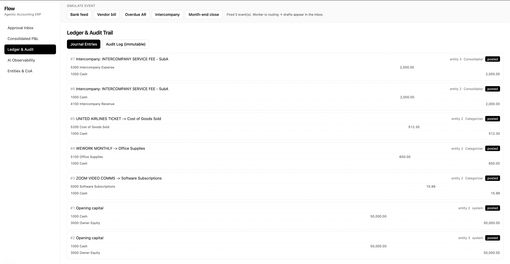

# Security & Auditability

This prototype is built so that **AI agents can read and write, but never finalize**.
The controls below make the system safe, accurate, and auditable.

## 1. Human-in-the-loop is the only write path to the books

- Agents only ever create `ProposedAction` rows (`status = pending`). They have **no code
  path** that posts to the ledger.
- The single function that posts —
  [`services/approvals.approve`](backend/app/services/approvals.py) — runs only from the
  authenticated inbox endpoint. There is no agent or webhook route into it.
- Approving and posting happen in **one DB transaction**; a failure rolls the whole thing
  back, so the ledger is never left half-posted.

## 2. Immutable audit trail

- Every approve/reject writes an `AuditLog` row: timestamp, **authenticated user**, agent,
  action, and before/after snapshots.
- There are **no update or delete endpoints** for `AuditLog` or `JournalEntry`. Posted
  history is append-only by construction.
- A draft can only be approved once; a second attempt is rejected by the gate
  (covered by `tests/test_approval_flow.py`).

The **Ledger & Audit** screen shows every journal entry (draft vs posted) alongside the
immutable audit log:

## 3. Authentication & identity integrity

- All state-changing endpoints (`/inbox/.../approve`, `/reject`, `/simulate`, `/webhooks/*`)
  depend on [`security.current_user`](backend/app/security.py).
- When `API_TOKEN` is set, requests must send `Authorization: Bearer <token>`; the token is
  compared with `hmac.compare_digest` (constant-time). The audit log records the
  server-side `API_USER` — **the client cannot supply or spoof the actor identity**.
- With `API_TOKEN` empty the API runs in open *local-dev* mode (actor `demo-user`). Always
  set a strong token for any shared or deployed environment.

## 4. Agent safety (no hallucination, no illegal actions)

- **Central safety preamble.** Every agent prompt is prefixed with a shared guardrail
  block ([`llm/client.SAFETY_PREAMBLE`](backend/app/llm/client.py)): propose-only, never
  act, never fabricate, escalate (confidence < 0.5) when unsure, never output secrets or
  bypass instructions. One agent cannot drift out of policy on its own.
- **No real-world action path.** Agents cannot move money, pay vendors, or send email —
  those are drafts a human approves. There is no code that lets an agent execute them.
- **Account/entity validation before posting.**
  [`approvals._validate_accounts`](backend/app/services/approvals.py) rejects any entry
  whose accounts don't exist or belong to a different entity — so a hallucinated or tampered
  payload can never post cross-entity or to a bogus account, no matter what an agent
  proposed.
- **Confidence gating.** Low-confidence proposals are surfaced in the inbox with their
  score so reviewers scrutinize them; agents are instructed to lower confidence rather than
  guess.
- **Full traceability.** Every decision (prompt, raw output, parsed result) is logged to
  `AgentTrace`, so any proposal can be explained and audited after the fact. See
  [OBSERVABILITY.md](OBSERVABILITY.md).

## 5. Accuracy controls

- **Double-entry is enforced** in [`services/ledger`](backend/app/services/ledger.py):
  debits must equal credits to the cent, and a zero-total entry is rejected — on both draft
  creation and posting.
- Money uses `Decimal` / SQL `NUMERIC(14,2)` end to end — no float rounding in the ledger.
- Consolidation eliminates intercompany accounts so the group P&L never double-counts
  internal activity (`tests/test_consolidation.py`).

## 6. Standard hardening

- **CORS** is restricted to `CORS_ORIGINS` (the frontend origin), not `*`.
- All DB access is via SQLAlchemy parameterized queries — no string-built SQL.
- All request bodies are validated by Pydantic models.
- Secrets come from environment/`.env` (git-ignored); none are committed.
- The backend container runs as a **non-root** user.
- Event publishing is best-effort: a broker outage logs a warning and never rolls back a
  committed, audited ledger action.

## Known limitations (prototype scope)

- Single shared bearer token rather than per-user accounts / RBAC. Swap
  `security.current_user` for real OIDC/JWT to get individual identities in the audit log.
- The frontend dev container runs as root for bind-mount convenience; build a production
  image (`next build` + non-root) before deploying.
- No rate limiting or secrets manager — add a gateway (rate limits, WAF) and a vault in
  production.
